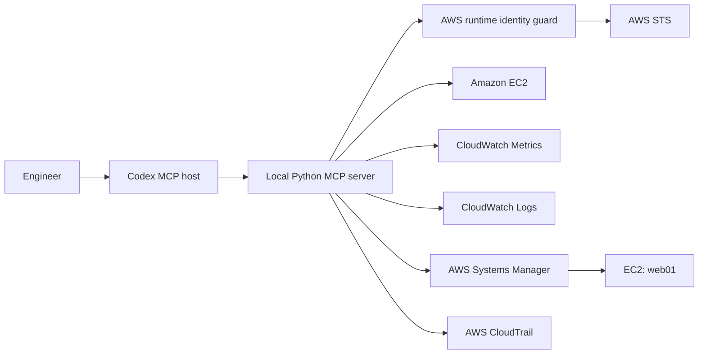

# AWS Infrastructure Operations MCP

A local, read-only MCP server that allows an AI client such as Codex to investigate an AWS EC2 workload using controlled, live evidence.

The server can inspect EC2 health, CloudWatch metrics, CloudWatch logs, nginx service state, the nginx system journal, and recent CloudTrail activity. It does not expose a general-purpose shell or any remediation capabilities.

## What this project demonstrates

This project combines:

- Model Context Protocol (MCP)
- Python and FastMCP
- AWS SDK for Python (Boto3)
- Amazon EC2
- Amazon CloudWatch Metrics
- Amazon CloudWatch Logs Insights
- AWS Systems Manager
- AWS CloudTrail
- AWS IAM and STS
- Terraform
- Least-privilege infrastructure diagnostics

The current implementation supports one approved lab instance named `web01` and one approved service named `nginx`.

## Architecture



Codex starts the MCP server as a local process and communicates with it over standard input and output.

The MCP server:

1. Validates its AWS account and assumed role.
2. Validates the requested instance, service, time range, and result limit.
3. Calls only approved AWS APIs.
4. Returns a limited structured result with its data source.
5. Does not perform remediation.

## MCP tools

The server exposes six live AWS-backed tools.

| Tool | Purpose | Data source |
| --- | --- | --- |
| `get_instance_health` | Returns EC2 state and AWS system and instance status checks | `aws` |
| `get_instance_metrics` | Returns fixed EC2 CPU, status-check, and network metrics | `aws-cloudwatch-metrics` |
| `get_recent_errors` | Searches approved CloudWatch log groups for recent errors | `aws-cloudwatch` |
| `get_recent_changes` | Returns bounded CloudTrail activity associated with the instance | `aws-cloudtrail-event-history` |
| `get_service_status` | Returns the current nginx systemd state through a fixed SSM document | `aws-ssm` |
| `get_service_journal` | Returns a bounded nginx system journal through a fixed SSM document | `aws-ssm-journal` |

### `get_instance_health`

```text
instance_name: str
```

Current restrictions:

- `instance_name` must be `web01`.
- Callers cannot supply an EC2 instance ID.
- Instance resolution requires the approved EC2 name and access tags.

The response includes:

- Instance ID
- AWS Region
- Availability Zone
- Private IP address
- EC2 state
- System status
- Instance status
- Check timestamp

### `get_instance_metrics`

```text
instance_name: str
minutes: int = 60
```

Current restrictions:

- `instance_name` must be `web01`.
- `minutes` must be between 5 and 1,440.
- The caller cannot supply a metric namespace, dimension, statistic, period, or CloudWatch query.

The tool retrieves a fixed set of `AWS/EC2` metrics:

- `CPUUtilization`
- `StatusCheckFailed`
- `StatusCheckFailed_Instance`
- `StatusCheckFailed_System`
- `NetworkIn`
- `NetworkOut`

Missing datapoints are returned as `null` rather than being represented as zero.

### `get_recent_errors`

```text
instance_name: str
maximum_results: int = 10
minutes: int = 60
```

Current restrictions:

- `instance_name` must be `web01`.
- `maximum_results` must be between 1 and 50.
- `minutes` must be between 5 and 1,440.
- Callers cannot provide Logs Insights query text or log-group names.

The server queries only:

```text
/aws/mcp-lab/web01/system
/aws/mcp-lab/web01/nginx
```

An empty result means that no matching events were returned within the requested window. It does not prove that the application is reachable or healthy.

### `get_recent_changes`

```text
instance_name: str
hours: int = 24
maximum_results: int = 25
```

Allowed lookback values:

```text
1, 6, 12, 24, 48, 72, 168 hours
```

Allowed result limits:

```text
10, 25, 50
```

The tool searches a fixed server-side allowlist of relevant EC2 and Systems Manager events. It then verifies that each event explicitly references the approved instance ID.

Returned event information is deliberately limited to:

- Event time
- Event name
- Event source
- Compact actor attribution
- CloudTrail read-only indicator
- Instance-matching method

The tool does not return raw CloudTrail JSON, credentials, request headers, source IP addresses, user-agent strings, or complete session context.

CloudTrail Event History is eventually consistent. Very recent API activity may take several minutes to appear.

### `get_service_status`

```text
instance_name: str
service_name: str
```

Current restrictions:

- `instance_name` must be `web01`.
- `service_name` must be `nginx`.
- The caller cannot provide a command, document name, path, instance ID, or shell argument.

The tool invokes only the Terraform-managed SSM document:

```text
mcp-lab-get-nginx-status
```

The document runs a fixed set of read-only `systemctl` checks and returns:

- Active state
- Sub-state
- Whether nginx is enabled at boot
- Command status
- Check timestamp

### `get_service_journal`

```text
instance_name: str
service_name: str
minutes: int = 60
maximum_results: int = 50
```

Allowed lookback values:

```text
5, 10, 15, 30, 60, 120 minutes
```

Allowed result limits:

```text
10, 25, 50, 100
```

The tool invokes only:

```text
mcp-lab-get-nginx-journal
```

The document fixes the systemd unit to nginx and executes a bounded, read-only journal query.

The SSM document internally uses the `aws:runShellScript` document plugin to execute its fixed command. This is not the same as allowing the MCP runtime to invoke the unrestricted AWS-managed `AWS-RunShellScript` document.

## Security boundaries

The project follows a defence-in-depth model.

### Dedicated runtime role

The MCP server uses a dedicated role:

```text
aws-infra-ops-mcp-lab-runtime
```

This is separate from:

- The Terraform administrator or source identity
- The EC2 instance profile
- The user’s interactive AWS identity

The runtime role receives only the permissions required by the approved diagnostic tools.

### Fail-closed identity guard

Before an AWS-backed tool creates its service client, the server calls AWS STS and validates:

- The expected AWS account
- The exact assumed-role name
- The expected STS assumed-role ARN structure

Required environment variables:

```text
MCP_EXPECTED_AWS_ACCOUNT_ID
MCP_EXPECTED_AWS_ROLE_NAME
```

The server accepts an identity shaped like:

```text
arn:aws:sts::<AWS_ACCOUNT_ID>:assumed-role/aws-infra-ops-mcp-lab-runtime/<session-name>
```

It rejects:

- Administrator roles
- Unexpected assumed roles
- IAM users
- The AWS account root identity
- Incorrect AWS accounts
- Missing or malformed identity configuration
- Incomplete STS responses

Only successful identity validation is cached for the lifetime of the MCP process.

### Approved targets

The current server supports only:

```text
Instance: web01
Service:  nginx
```

The instance must have these tags:

| Tag | Value |
| --- | --- |
| `Name` | `web01` |
| `MCPAccess` | `allowed` |

The model cannot provide arbitrary instance IDs, AWS queries, commands, files, services, document names, log groups, or metric names.

### No remediation

The server does not provide tools to:

- Start, stop, reboot, or terminate EC2 instances
- Restart services
- Change security groups or routes
- Modify IAM
- Execute arbitrary shell commands
- Create or delete AWS resources
- Change application configuration
- Run Terraform
- Open interactive SSM sessions

Any recovery action remains a separate, human-controlled activity.

## Repository structure

```text
aws-infra-ops-mcp/
├── aws_infra_ops_mcp/
│   ├── tools/
│   │   ├── instance_health.py
│   │   ├── instance_metrics.py
│   │   ├── recent_changes.py
│   │   ├── recent_errors.py
│   │   ├── service_journal.py
│   │   └── service_status.py
│   ├── __init__.py
│   ├── app.py
│   ├── aws.py
│   ├── policy.py
│   └── runtime_identity.py
├── infrastructure/
│   ├── modules/
│   ├── main.tf
│   ├── outputs.tf
│   ├── providers.tf
│   ├── terraform.tfvars.example
│   ├── variables.tf
│   └── versions.tf
├── .gitignore
├── pyproject.toml
├── README.md
└── server.py
```

## Prerequisites

- Python 3.11 or newer
- Terraform 1.6 or newer
- AWS CLI
- AWS Session Manager plugin
- Codex with local MCP support
- An AWS source identity that can deploy the Terraform configuration
- An AWS Region configured

The example infrastructure defaults to:

```text
ap-southeast-1
```

## Local installation

On Linux, macOS, or WSL:

```bash
cd <PROJECT_DIR>
python3 -m venv .venv
source .venv/bin/activate
python -m pip install --upgrade pip
python -m pip install -e .
```

On Windows PowerShell:

```powershell
Set-Location <PROJECT_DIR>
python -m venv .venv
.\.venv\Scripts\Activate.ps1
python -m pip install --upgrade pip
python -m pip install -e .
```

## AWS profiles

Use separate profiles for deployment and diagnostics.

### Deployment profile

The source or administrator profile is used by Terraform:

```text
default
```

### MCP runtime profile

The MCP server uses:

```text
mcp-lab-runtime
```

Example AWS configuration:

```ini
[profile mcp-lab-runtime]
role_arn = arn:aws:iam::<AWS_ACCOUNT_ID>:role/aws-infra-ops-mcp-lab-runtime
source_profile = default
role_session_name = aws-infra-ops-mcp
duration_seconds = 3600
region = ap-southeast-1
```

Do not run Terraform using `mcp-lab-runtime`. Its restricted permissions are intentional.

## Terraform deployment

Copy the example variables file:

```bash
cp infrastructure/terraform.tfvars.example infrastructure/terraform.tfvars
```

Update the values for your AWS account and environment.

Deploy using the source or administrator profile:

```bash
export AWS_PROFILE=default

terraform -chdir=infrastructure init
terraform -chdir=infrastructure fmt -check -recursive
terraform -chdir=infrastructure validate
terraform -chdir=infrastructure plan -out=tfplan
terraform -chdir=infrastructure apply tfplan
```

Terraform creates the lab infrastructure, including:

- Networking
- EC2 instance
- EC2 instance profile
- Systems Manager connectivity
- CloudWatch log groups
- CloudWatch Agent configuration
- Custom SSM diagnostic documents
- Restricted MCP runtime role
- Read-only diagnostic IAM policy

Terraform uses local state in this example. State files and variable files are excluded from Git and must be stored securely.

## Running the MCP server

Set the runtime profile and identity guard values:

```bash
export AWS_PROFILE=mcp-lab-runtime
export AWS_REGION=ap-southeast-1
export AWS_DEFAULT_REGION=ap-southeast-1
export AWS_SDK_LOAD_CONFIG=1
export MCP_EXPECTED_AWS_ACCOUNT_ID=<AWS_ACCOUNT_ID>
export MCP_EXPECTED_AWS_ROLE_NAME=aws-infra-ops-mcp-lab-runtime
```

Start the server:

```bash
aws-infra-ops-mcp
```

For a local stdio server, it may appear to wait without displaying a prompt. That is expected because it is waiting for MCP messages on standard input.

## Connecting Codex

Add the server to your Codex configuration:

```toml
[mcp_servers.aws-infra-ops-lab]
command = "/absolute/path/to/aws-infra-ops-mcp/.venv/bin/python"
args = ["/absolute/path/to/aws-infra-ops-mcp/server.py"]
cwd = "/absolute/path/to/aws-infra-ops-mcp"

[mcp_servers.aws-infra-ops-lab.env]
AWS_PROFILE = "mcp-lab-runtime"
AWS_REGION = "ap-southeast-1"
AWS_DEFAULT_REGION = "ap-southeast-1"
AWS_SDK_LOAD_CONFIG = "1"
MCP_EXPECTED_AWS_ACCOUNT_ID = "<AWS_ACCOUNT_ID>"
MCP_EXPECTED_AWS_ROLE_NAME = "aws-infra-ops-mcp-lab-runtime"
```

Restart Codex after changing its MCP configuration.

Use `/mcp` to confirm the server and its six tools are available.

## Example requests

```text
Check the health of web01 and show the evidence source.
```

```text
Show the EC2 metrics for web01 over the last 60 minutes.
```

```text
Find recent errors for web01 during the last 15 minutes.
```

```text
Check the nginx service state on web01.
```

```text
Read the nginx journal for web01 over the last 30 minutes.
```

```text
Show recent AWS control-plane activity associated with web01 and identify
whether each event came from the administrator or MCP runtime role.
```

A broader investigation could ask:

```text
Investigate why nginx on web01 appears unavailable. Correlate EC2 health,
CloudWatch metrics, recent errors, nginx service state, the nginx journal, and
recent AWS control-plane activity. Separate confirmed evidence from inference,
state the limitations, and do not perform remediation.
```

## Troubleshooting

### Terraform returns `AccessDenied`

Confirm Terraform is using the source or administrator profile:

```bash
export AWS_PROFILE=default
```

The MCP runtime role is intentionally unable to manage the Terraform infrastructure.

### The MCP server rejects its AWS identity

Check:

- `AWS_PROFILE`
- AWS account ID
- Runtime role ARN
- `MCP_EXPECTED_AWS_ACCOUNT_ID`
- `MCP_EXPECTED_AWS_ROLE_NAME`
- The source profile’s current authentication session

Confirm the runtime identity:

```bash
aws sts get-caller-identity --profile mcp-lab-runtime
```

The ARN should include:

```text
assumed-role/aws-infra-ops-mcp-lab-runtime/
```

### CloudWatch Logs returns `AccessDenied`

Confirm the current Terraform-managed runtime policy has been deployed.

The approved CloudWatch log-group resource ARNs must include the suffix required for querying their streams.

### Service status or journal requests fail

Confirm:

- `web01` is online in Systems Manager
- SSM Agent is running
- The custom SSM documents exist
- The runtime policy references the approved documents and instance
- The request uses `web01` and `nginx`

### Recent errors are empty

Confirm:

- CloudWatch Agent is running
- The approved log groups contain current streams
- The requested time range covers the expected event
- The event matches the server’s fixed error query

### Recent CloudTrail changes are empty

CloudTrail Event History is eventually consistent. Wait several minutes and retry with an appropriate lookback.

An empty result does not prove that no activity occurred.

### Codex does not show the tools

Confirm:

- The MCP configuration uses absolute paths
- The virtual environment contains the package
- The server starts successfully
- Codex was restarted after the configuration changed

## Current limitations

- Only `web01` is supported.
- Only the `nginx` service is supported.
- Dynamic fleet discovery is not implemented.
- There is no HTTP or end-to-end application reachability tool.
- CloudWatch log groups are fixed to the lab instance.
- The journal tool cannot inspect arbitrary services or files.
- CloudTrail results cover a fixed event allowlist.
- Terraform state is local.
- The example lab uses a public subnet for outbound connectivity.
- Diagnostics are read-only.
- Recovery remains operator-controlled.

## Teardown and cost control

Teardown is destructive.

Use the Terraform source or administrator profile—not the MCP runtime role:

```bash
export AWS_PROFILE=default
terraform -chdir=infrastructure plan -destroy -out=destroy.tfplan
```

Review the saved plan carefully.

Apply only the reviewed destroy plan:

```bash
terraform -chdir=infrastructure apply destroy.tfplan
```

Verify that Terraform no longer tracks any resources:

```bash
terraform -chdir=infrastructure state list
```

Destroying the AWS resources stops their ongoing infrastructure costs. It does not remove the local source code, Git history, virtual environment, or Terraform files.

## Future enhancements

Potential future improvements include:

- Tag-based dynamic discovery of approved instances
- Bounded fleet-health tools
- Read-only HTTP or load-balancer health checks
- Cross-account diagnostics using controlled role assumption
- Remote MCP hosting
- Multi-user authentication and authorization
- Encrypted remote Terraform state with locking
- Central application audit logging
- Human-approved remediation workflows in a separately controlled service

## Disclaimer

This project is a learning and demonstration environment. Review its IAM policies, networking, logging, data handling, and operational controls before adapting it for production use.
